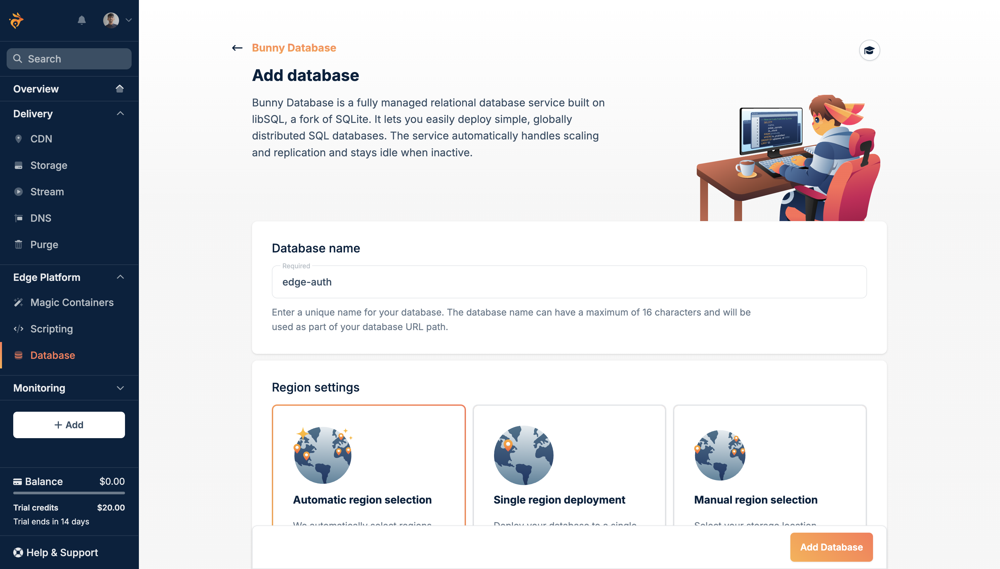
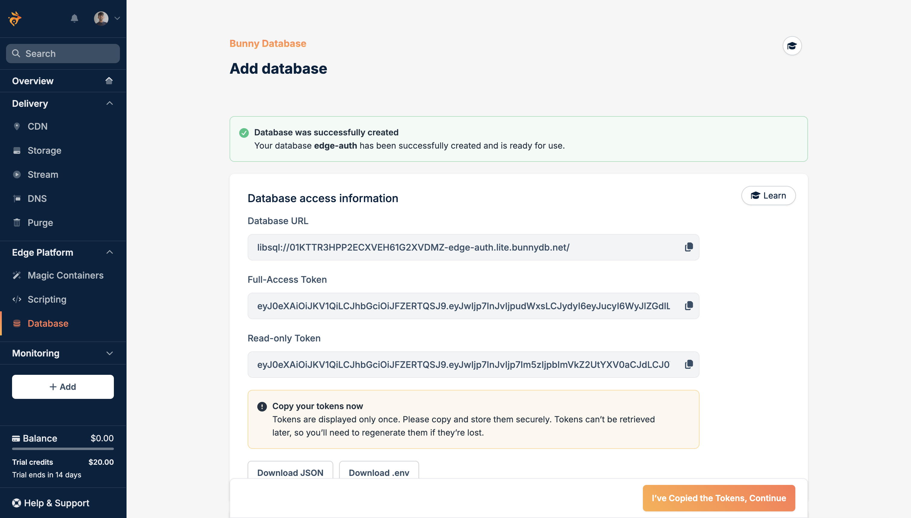
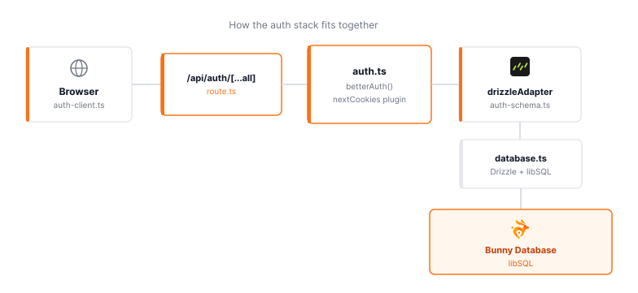
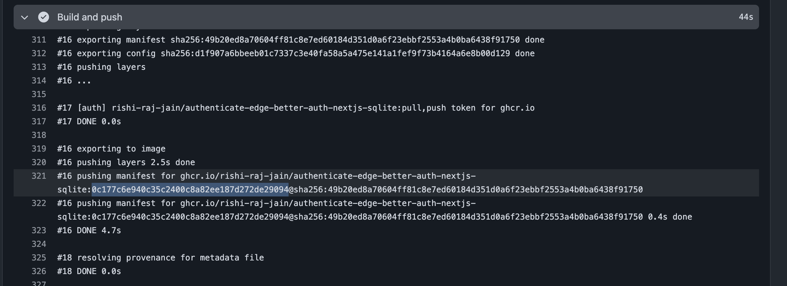
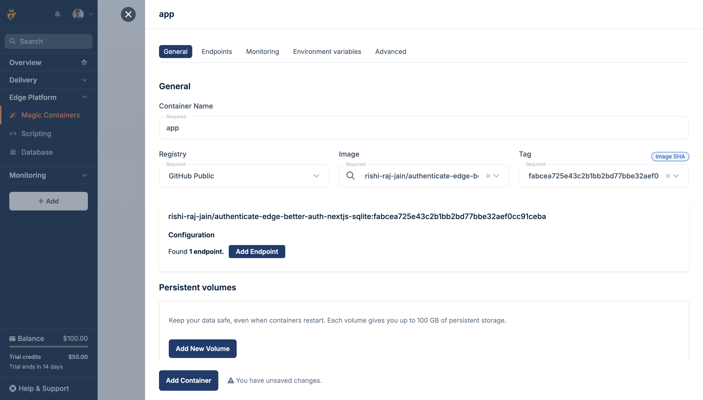
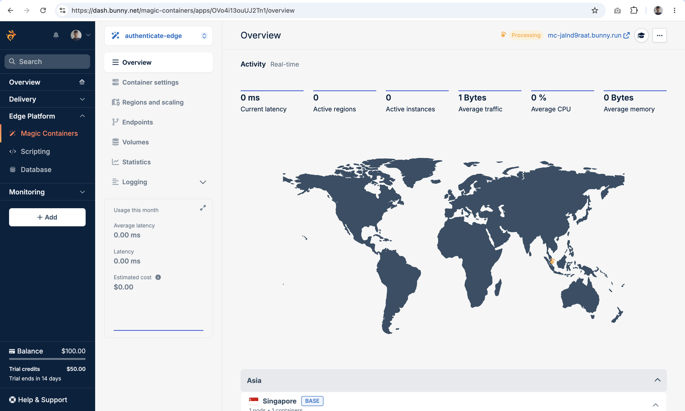
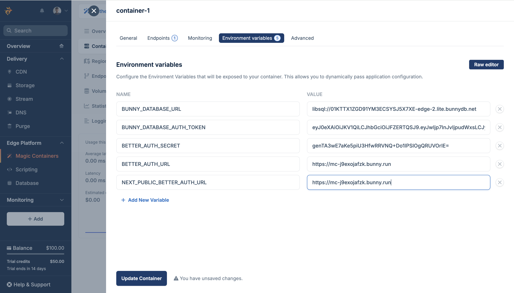
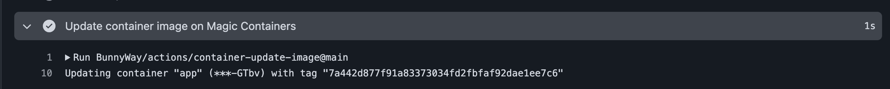
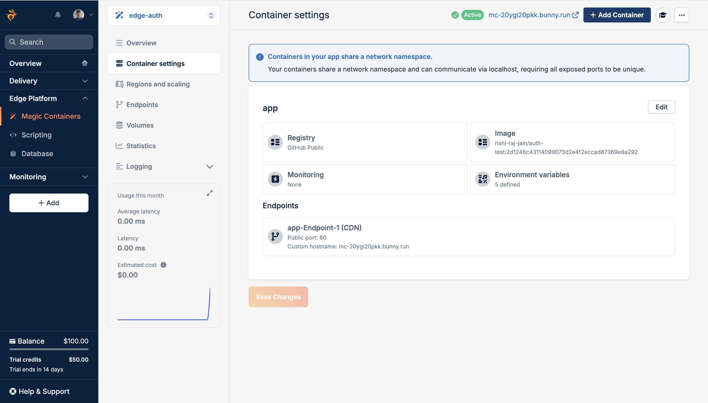
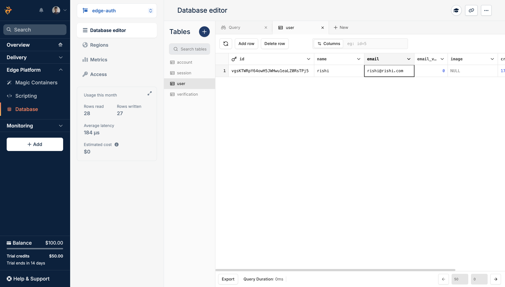

Have you ever wondered how fast your applications could be if every part of your stack ran right next to your users all over the world? If you build a truly edge-first stack using Bunny Magic Containers for your application and Bunny Database for globally distributed data, you keep every layer close to your users. This reduces round-trip times and delivers better experiences.

In this guide, you will learn how to create a Next.js 16 app, wire Better Auth with the new proxy pattern, connect users and sessions to Bunny Database (SQLite), protect the home page with full session validation, containerize the app, and deploy it to Bunny Magic Containers with GitHub Actions.

## Prerequisites

To follow along in this guide, you will need the following:

- [Node.js 22](https://nodejs.org/en) or later
- A [Bunny.net](https://bunny.net) account
- A [GitHub](https://github.com) account

## Provision a Globally Replicated SQLite Database

Using [Bunny Database](https://bunny.net/database/) gives you SQLite with libSQL replication globally, so the session reads stay fast no matter where your container runs.

To get started, open the [Bunny dashboard](https://dash.bunny.net) and go to **Edge Platform > Database**. Click **Create Your First Database**, enter the **Database name**, select **Automatic region selection** and click **Add database**.



Once it's provisioned, you will see that the Database URL and a Full-Access Token is available for you to use.



Save the Database URL and Full-Access Token somewhere safe to be used as the `BUNNY_DATABASE_URL` and `BUNNY_DATABASE_AUTH_TOKEN` further in the guide. Proceed further in this guide to create a Next.js application.

## Create a new Next.js 16 application

Let’s get started by creating a new Next.js project. Open your terminal and run the following command:

```bash
npx create-next-app@latest edge-auth
```

When prompted, choose the recommended defaults. That installs Next.js, React, Tailwind CSS, and ESLint automatically.

Once that’s done, you can move into the project directory and start the app:

```bash
cd edge-auth
npm run dev
```

The app should be running on [localhost:3000](http://localhost:3000). Let's close the development server for now.

Now, enable standalone output in `next.config.ts` so the app can run inside a Docker container:

```tsx
// File: next.config.ts

import type { NextConfig } from "next";

const nextConfig: NextConfig = {
  output: "standalone",
};

export default nextConfig;
```

Finally, install a robust authentication library (better-auth) and an ORM (drizzle) to securely manage your users:

```bash
npm install better-auth @better-auth/drizzle-adapter drizzle-orm @libsql/client
npm install -D drizzle-kit
```

The above command installs the following packages:

- [better-auth](https://www.better-auth.com/docs/installation): the auth server, session handling, and React client
- [@better-auth/drizzle-adapter](https://www.better-auth.com/docs/adapters/drizzle): the Drizzle adapter for users, sessions, and accounts
- [drizzle-orm](https://orm.drizzle.team/): the ORM that talks to Bunny Database through libSQL
- [@libsql/client](http://npmjs.com/package/@libsql/client): TypeScript/JavaScript client API for libSQL

Let's move over to establishing a connection to database from the Next.js application via Drizzle.

## Connect Drizzle to Bunny Database over libSQL

Create a `.env` file in the project root with your Bunny credentials and a manually generated random string:

```bash
# .env

BUNNY_DATABASE_URL="libsql://your-database-id.lite.bunnydb.net"
BUNNY_DATABASE_AUTH_TOKEN="your-access-token"
BETTER_AUTH_SECRET="generate-a-long-random-string" # openssl rand -base64 32
BETTER_AUTH_URL="http://localhost:3000"
NEXT_PUBLIC_BETTER_AUTH_URL="http://localhost:3000"
```

In the environment variables above:

- `BETTER_AUTH_SECRET` is used to sign session cookies. Generate it with `openssl rand -base64 32`.
- `BETTER_AUTH_URL` and `NEXT_PUBLIC_BETTER_AUTH_URL` must match the origin where your app runs. Update then to your production URL when you deploy.

Now, create a `database.ts` at the project root with a Drizzle client pointed at Bunny Database:

```tsx
// File: database.ts

import { drizzle } from "drizzle-orm/libsql";

if (!process.env.BUNNY_DATABASE_URL) {
  throw new Error("BUNNY_DATABASE_URL is not set");
}
if (!process.env.BUNNY_DATABASE_AUTH_TOKEN) {
  throw new Error("BUNNY_DATABASE_AUTH_TOKEN is not set");
}

export const db = drizzle({
  connection: {
    url: process.env.BUNNY_DATABASE_URL,
    authToken: process.env.BUNNY_DATABASE_AUTH_TOKEN,
  },
});
```

Next, add a `drizzle.config.ts` at the project root:

```tsx
// File: drizzle.config.ts

import { defineConfig } from "drizzle-kit";

if (!process.env.BUNNY_DATABASE_URL) {
  throw new Error("BUNNY_DATABASE_URL is not set");
}
if (!process.env.BUNNY_DATABASE_AUTH_TOKEN) {
  throw new Error("BUNNY_DATABASE_AUTH_TOKEN is not set");
}

export default defineConfig({
  schema: "./auth-schema.ts",
  dialect: "sqlite",
  dbCredentials: {
    url: process.env.BUNNY_DATABASE_URL + "?authToken=" + process.env.BUNNY_DATABASE_AUTH_TOKEN,
  },
});
```

Let's move over to enabling email and password authentication in the application.

## Set up Better Auth with Drizzle in Next.js 16

This section will guide you through integrating Better Auth with Drizzle ORM in Next.js using SQLite, enabling secure email/password authentication step-by-step.



### Configure Better Auth with Email and Password

First, create a `auth.ts` file at the project root which enables email and password sign-in, using the Drizzle adapter and the [`nextCookies` plugin](https://better-auth.com/docs/integrations/next#server-action-cookies) so server actions can set the session cookies.

```tsx
// File: auth.ts

import { db } from "./database";
// import * as schema from "./auth-schema";
import { betterAuth } from "better-auth";
import { nextCookies } from "better-auth/next-js";
import { drizzleAdapter } from "@better-auth/drizzle-adapter";

export const auth = betterAuth({
  plugins: [nextCookies()],
  emailAndPassword: { enabled: true },
  database: drizzleAdapter(db, { provider: "sqlite" }),
});
```

The `nextCookies` plugin must be the last entry in the `plugins` array. Without it, sign-in calls from server actions will not write cookies back to the browser.

### Generate the auth schema and push tables

Better Auth has a CLI that writes Drizzle tables for users, sessions, accounts, and verification tokens. Run it with the following command:

```bash
npx auth@latest generate
```

When prompted, select yes to generate the schema to `./auth-schema.ts`.

Push the schema to your Bunny Database:

```bash
npx drizzle-kit push
```

After `drizzle-kit push` completes, your Bunny Database has all the relevant auth tables.

Finally, include the schema in the `auth.ts` file with the code changes as following:

```diff
// File: auth.ts

import { db } from "./database";
+ import * as schema from "./auth-schema";
import { betterAuth } from "better-auth";
import { nextCookies } from "better-auth/next-js";
import { drizzleAdapter } from "@better-auth/drizzle-adapter";

export const auth = betterAuth({
  plugins: [nextCookies()],
  emailAndPassword: { enabled: true },
  database: drizzleAdapter(db, {
    provider: "sqlite",
+    schema
  }),
});
```

### Add the Next.js API Route Handler for Authentication

Next, create a catch-all route handler at `app/api/auth/[...all]/route.ts` in your Next.js App Router using the following code:

```tsx
// File: app/api/auth/[...all]/route.ts

import { auth } from "@/auth";
import { toNextJsHandler } from "better-auth/next-js";

export const { GET, POST } = toNextJsHandler(auth);
```

This single API route will handle sign-up, sign-in, sign-out, session refresh, and any plugin routes you may add in the future.

### Create the auth client

Create `auth-client.ts` at the project root so React components can call Better Auth:

```tsx
// File: auth-client.ts

import { createAuthClient } from "better-auth/react";

export const { signIn, signUp, signOut, useSession } = createAuthClient({
  baseURL: process.env.NEXT_PUBLIC_BETTER_AUTH_URL,
});
```

`NEXT_PUBLIC_BETTER_AUTH_URL` must match `BETTER_AUTH_URL` in your `.env` file during local development.

## Add sign-in and sign-up pages

Build a sign-in page that calls `signIn.email` on submit and redirects to `/` on success:

```tsx
// File: app/sign-in/page.tsx

"use client";

import Link from "next/link";
import { useRouter } from "next/navigation";
import { useState } from "react";
import { signIn } from "@/auth-client";

export default function SignInPage() {
  const router = useRouter();
  const [email, setEmail] = useState("");
  const [password, setPassword] = useState("");
  const [error, setError] = useState<string | null>(null);
  const [pending, setPending] = useState(false);

  async function handleSubmit(event: React.FormEvent<HTMLFormElement>) {
    event.preventDefault();
    setError(null);
    setPending(true);
    const { error: signInError } = await signIn.email({ email, password });
    if (signInError) {
      setError(signInError.message ?? "Sign in failed");
      setPending(false);
      return;
    }
    router.push("/");
    router.refresh();
  }

  return (
    <div className="flex flex-1 items-center justify-center bg-zinc-50 px-6 py-16 dark:bg-black">
      <main className="w-full max-w-sm rounded-2xl border border-black/[.08] bg-white p-8 dark:border-white/[.145] dark:bg-zinc-950">
        <h1 className="text-2xl font-semibold tracking-tight text-black dark:text-zinc-50">
          Sign in
        </h1>
        <p className="mt-2 text-sm text-zinc-600 dark:text-zinc-400">
          Sign in with email and password.
        </p>

        <form onSubmit={handleSubmit} className="mt-8 flex flex-col gap-4">
          <label className="flex flex-col gap-2 text-sm font-medium text-zinc-700 dark:text-zinc-300">
            Email
            <input
              className="rounded-lg border border-zinc-200 bg-white px-3 py-2 font-normal text-black outline-none focus:border-zinc-400 dark:border-zinc-800 dark:bg-black dark:text-zinc-50"
              type="email"
              autoComplete="email"
              value={email}
              onChange={(event) => setEmail(event.target.value)}
              required
            />
          </label>

          <label className="flex flex-col gap-2 text-sm font-medium text-zinc-700 dark:text-zinc-300">
            Password
            <input
              className="rounded-lg border border-zinc-200 bg-white px-3 py-2 font-normal text-black outline-none focus:border-zinc-400 dark:border-zinc-800 dark:bg-black dark:text-zinc-50"
              type="password"
              autoComplete="current-password"
              value={password}
              onChange={(event) => setPassword(event.target.value)}
              required
            />
          </label>

          {error ? (
            <p className="text-sm text-red-600 dark:text-red-400">{error}</p>
          ) : null}

          <button
            className="mt-2 flex h-11 items-center justify-center rounded-full bg-foreground px-5 text-sm font-medium text-background transition-colors hover:bg-[#383838] disabled:cursor-not-allowed disabled:opacity-60 dark:hover:bg-[#ccc]"
            type="submit"
            disabled={pending}
          >
            {pending ? "Signing in..." : "Sign in"}
          </button>
        </form>

        <p className="mt-6 text-center text-sm text-zinc-600 dark:text-zinc-400">
          No account yet?{" "}
          <Link
            href="/sign-up"
            className="font-medium text-black underline-offset-4 hover:underline dark:text-zinc-50"
          >
            Sign up
          </Link>
        </p>
      </main>
    </div>
  );
}
```

Create a matching sign-up page that calls `signUp.email`:

```tsx
// File: app/sign-up/page.tsx

"use client";

import Link from "next/link";
import { useRouter } from "next/navigation";
import { useState } from "react";
import { signUp } from "@/auth-client";

export default function SignUpPage() {
  const router = useRouter();
  const [name, setName] = useState("");
  const [email, setEmail] = useState("");
  const [password, setPassword] = useState("");
  const [error, setError] = useState<string | null>(null);
  const [pending, setPending] = useState(false);

  async function handleSubmit(event: React.FormEvent<HTMLFormElement>) {
    event.preventDefault();
    setError(null);
    setPending(true);
    const { error: signUpError } = await signUp.email({ name, email, password });
    if (signUpError) {
      setError(signUpError.message ?? "Sign up failed");
      setPending(false);
      return;
    }
    router.push("/");
    router.refresh();
  }

  return (
    <div className="flex flex-1 items-center justify-center bg-zinc-50 px-6 py-16 dark:bg-black">
      <main className="w-full max-w-sm rounded-2xl border border-black/[.08] bg-white p-8 dark:border-white/[.145] dark:bg-zinc-950">
        <h1 className="text-2xl font-semibold tracking-tight text-black dark:text-zinc-50">
          Create account
        </h1>
        <p className="mt-2 text-sm text-zinc-600 dark:text-zinc-400">
          Start with a local account stored in Bunny Database.
        </p>

        <form onSubmit={handleSubmit} className="mt-8 flex flex-col gap-4">
          <label className="flex flex-col gap-2 text-sm font-medium text-zinc-700 dark:text-zinc-300">
            Name
            <input
              className="rounded-lg border border-zinc-200 bg-white px-3 py-2 font-normal text-black outline-none focus:border-zinc-400 dark:border-zinc-800 dark:bg-black dark:text-zinc-50"
              type="text"
              autoComplete="name"
              value={name}
              onChange={(event) => setName(event.target.value)}
              required
            />
          </label>

          <label className="flex flex-col gap-2 text-sm font-medium text-zinc-700 dark:text-zinc-300">
            Email
            <input
              className="rounded-lg border border-zinc-200 bg-white px-3 py-2 font-normal text-black outline-none focus:border-zinc-400 dark:border-zinc-800 dark:bg-black dark:text-zinc-50"
              type="email"
              autoComplete="email"
              value={email}
              onChange={(event) => setEmail(event.target.value)}
              required
            />
          </label>

          <label className="flex flex-col gap-2 text-sm font-medium text-zinc-700 dark:text-zinc-300">
            Password
            <input
              className="rounded-lg border border-zinc-200 bg-white px-3 py-2 font-normal text-black outline-none focus:border-zinc-400 dark:border-zinc-800 dark:bg-black dark:text-zinc-50"
              type="password"
              autoComplete="new-password"
              value={password}
              onChange={(event) => setPassword(event.target.value)}
              required
            />
          </label>

          {error ? (
            <p className="text-sm text-red-600 dark:text-red-400">{error}</p>
          ) : null}

          <button
            className="mt-2 flex h-11 items-center justify-center rounded-full bg-foreground px-5 text-sm font-medium text-background transition-colors hover:bg-[#383838] disabled:cursor-not-allowed disabled:opacity-60 dark:hover:bg-[#ccc]"
            type="submit"
            disabled={pending}
          >
            {pending ? "Creating account..." : "Sign up"}
          </button>
        </form>

        <p className="mt-6 text-center text-sm text-zinc-600 dark:text-zinc-400">
          Already have an account?{" "}
          <Link
            href="/sign-in"
            className="font-medium text-black underline-offset-4 hover:underline dark:text-zinc-50"
          >
            Sign in
          </Link>
        </p>
      </main>
    </div>
  );
}
```

Start the dev server and confirm that the pages render as expected:

```bash
npm run dev
```

Open [http://localhost:3000/sign-up](http://localhost:3000/sign-up), create an account, and verify that after signing up, you are redirected to the `/` page. Once this is working, proceed to the next step which makes the home page accessible only to the authenticated users.

## Build the protected home page

Now, let's update the home page at `app/page.tsx` to be the signed-in view. This page should read the session on the server and display the user's name, email, and session ID. You don't need to implement redirect logic here, because route protection will be handled in a file called `proxy.ts`.

```tsx
// File: app/page.tsx

import { headers } from "next/headers";
import { auth } from "@/auth";
import { SignOutButton } from "./sign-out-button";

export default async function Home() {
  const session = await auth.api.getSession({
    headers: await headers(),
  });
  return (
    <div className="flex flex-1 items-center justify-center bg-zinc-50 px-6 py-16 dark:bg-black">
      <main className="w-full max-w-lg rounded-2xl border border-black/[.08] bg-white p-8 dark:border-white/[.145] dark:bg-zinc-950">
        <p className="text-sm font-medium uppercase tracking-wide text-zinc-500 dark:text-zinc-400">
          Home
        </p>
        <h1 className="mt-2 text-3xl font-semibold tracking-tight text-black dark:text-zinc-50">
          Welcome, {session?.user.name ?? "there"}
        </h1>
        <p className="mt-3 text-base text-zinc-600 dark:text-zinc-400">
          Signed in as{" "}
          <span className="font-medium text-black dark:text-zinc-50">
            {session?.user.email}
          </span>
        </p>
        <div className="mt-8 rounded-xl border border-zinc-200 bg-zinc-50 p-4 dark:border-zinc-800 dark:bg-black">
          <p className="text-sm text-zinc-600 dark:text-zinc-400">Session ID</p>
          <p className="mt-1 break-all font-mono text-sm text-zinc-900 dark:text-zinc-100">
            {session?.session.id}
          </p>
        </div>
        <div className="mt-8">
          <SignOutButton />
        </div>
      </main>
    </div>
  );
}
```

Next, add a client sign-out button at `app/sign-out-button.tsx` that calls `signOut` and sends the user back to `/sign-in`:

```tsx
// File: app/sign-out-button.tsx

"use client";

import { useRouter } from "next/navigation";
import { useState } from "react";
import { signOut } from "@/auth-client";

export function SignOutButton() {
  const router = useRouter();
  const [pending, setPending] = useState(false);
  async function handleSignOut() {
    setPending(true);
    await signOut();
    router.push("/sign-in");
    router.refresh();
  }
  return (
    <button
      className="flex h-11 items-center justify-center rounded-full border border-solid border-black/[.08] px-5 text-sm font-medium transition-colors hover:border-transparent hover:bg-black/[.04] disabled:cursor-not-allowed disabled:opacity-60 dark:border-white/[.145] dark:hover:bg-[#1a1a1a]"
      type="button"
      onClick={handleSignOut}
      disabled={pending}
    >
      {pending ? "Signing out..." : "Sign out"}
    </button>
  );
}
```

## Protect routes with the Next.js 16 proxy

The [Next.js 16 proxy](https://nextjs.org/docs/app/getting-started/proxy) is a server-side middleware feature that allows you to intercept and control requests before they reach your page or API logic, allowing you to validate sessions and perform redirects before rendering the route.

Create a `proxy.ts` file at the project root with the following code:

```tsx
// File: proxy.ts

import { NextRequest, NextResponse } from "next/server";
import { headers } from "next/headers";
import { auth } from "./auth";

const guestRoutes = ["/sign-in", "/sign-up"];

function isGuestRoute(pathname: string) {
  return guestRoutes.includes(pathname);
}

function isProtectedRoute(pathname: string) {
  return pathname === "/";
}

export async function proxy(request: NextRequest) {
  const { pathname } = request.nextUrl;

  const session = await auth.api.getSession({
    headers: await headers(),
  });

  if (session && isGuestRoute(pathname)) {
    return NextResponse.redirect(new URL("/", request.url));
  }

  if (!session && isProtectedRoute(pathname)) {
    return NextResponse.redirect(new URL("/sign-in", request.url));
  }

  return NextResponse.next();
}

export const config = {
  matcher: ["/", "/sign-in", "/sign-up"],
};
```

The code above routes the incoming requests as follows:

| Route | No session | Has session |
|---|---|---|
| `/` | redirect to `/sign-in` | show home page |
| `/sign-in`, `/sign-up` | show auth page | redirect to `/` |

Let's move over to the next step to containerize the application to be deployed on Bunny Magic Containers.

## Containerize with Docker

Create a `Dockerfile` at the project root with the following code:

```dockerfile
# File: Dockerfile

FROM node:22-alpine AS base

FROM base AS deps
WORKDIR /app
COPY package*.json ./
RUN npm ci

FROM base AS builder
WORKDIR /app
COPY --from=deps /app/node_modules ./node_modules
COPY . .

ARG BUNNY_DATABASE_URL
ARG BUNNY_DATABASE_AUTH_TOKEN
ARG BETTER_AUTH_SECRET
ARG BETTER_AUTH_URL

ENV BUNNY_DATABASE_URL=$BUNNY_DATABASE_URL \
    BUNNY_DATABASE_AUTH_TOKEN=$BUNNY_DATABASE_AUTH_TOKEN \
    BETTER_AUTH_SECRET=$BETTER_AUTH_SECRET \
    BETTER_AUTH_URL=$BETTER_AUTH_URL \
    NEXT_PUBLIC_BETTER_AUTH_URL=$BETTER_AUTH_URL

RUN npm run build

FROM base AS runner
WORKDIR /app
ENV NODE_ENV=production

COPY --from=builder /app/.next/standalone ./
COPY --from=builder /app/.next/static ./.next/static
COPY --from=builder /app/public ./public

ENV PORT=80
EXPOSE 80

CMD ["node", "server.js"]
```

In the Dockerfile above:

- The `builder` stage uses build arguments (`ARG`) that are typically populated with repository secrets via GitHub Actions.
- `NEXT_PUBLIC_BETTER_AUTH_URL` is automatically set from `BETTER_AUTH_URL`, so you only need to provide one public URL secret during the build process.

Further, add a `.dockerignore` so your local `.env` never gets copied into the image context:

```bash
# File: .dockerignore

.env
.env.*
!.env.example
.git
.github
.next
node_modules
```

Note that the runtime environment variables are not baked into the final runner image. Magic Containers injects `BUNNY_DATABASE_URL` and `BUNNY_DATABASE_AUTH_TOKEN` when you link the database. You configure the rest in the deployment steps below.

## Push the initial GitHub Actions workflow

Create a GitHub workflow at `.github/workflows/build.yml` with the following code that builds and publishes the Docker image to GitHub Container Registry:

```yml
# File: .github/workflows/build.yml

name: Build and Push

on:
  workflow_dispatch:
  push:
    branches: [main]

env:
  REGISTRY: ghcr.io
  IMAGE_NAME: ${{ github.repository }}

jobs:
  build-and-push:
    runs-on: ubuntu-latest
    permissions:
      contents: read
      packages: write

    steps:
      - uses: actions/checkout@v4

      - name: Log in to GitHub Container Registry
        uses: docker/login-action@v3
        with:
          registry: ${{ env.REGISTRY }}
          username: ${{ github.actor }}
          password: ${{ secrets.GITHUB_TOKEN }}

      - name: Set up Docker Buildx
        uses: docker/setup-buildx-action@v3

      - name: Build and push
        uses: docker/build-push-action@v6
        with:
          context: .
          push: true
          platforms: linux/amd64
          provenance: false
          sbom: false
          tags: ${{ env.REGISTRY }}/${{ env.IMAGE_NAME }}:${{ github.sha }}
          build-args: |
            BUNNY_DATABASE_URL=${{ secrets.BUNNY_DATABASE_URL }}
            BUNNY_DATABASE_AUTH_TOKEN=${{ secrets.BUNNY_DATABASE_AUTH_TOKEN }}
            BETTER_AUTH_SECRET=${{ secrets.BETTER_AUTH_SECRET }}
            BETTER_AUTH_URL=${{ secrets.BETTER_AUTH_URL }}
```

Before committing the above code to GitHub, add these secrets under **Settings > Secrets and variables > Actions > New repository secret** in your GitHub repository:

| Secret | Initial value |
|---|---|
| `BUNNY_DATABASE_URL` | libSQL URL from the Bunny Database dashboard |
| `BUNNY_DATABASE_AUTH_TOKEN` | Full-access token from the Bunny Database dashboard |
| `BETTER_AUTH_SECRET` | Output of `openssl rand -base64 32` |
| `BETTER_AUTH_URL` | `http://localhost:3000` for the first build |

Push to the `main` branch and wait for the workflow to finish. Open the run in GitHub Actions and note the image name and image tag from the build output. The tag is the commit SHA, for example `0c177c6e940c35c2400c8a82ee187d272de29094`.



## Create the Magic Containers app

To deploy your Docker container on Bunny, open the [Bunny dashboard](https://dash.bunny.net), go to **Edge Platform > Magic Containers > Add Your First App**. Enter an app name and click **Next Step**.

Now, click **Add Container** and configure the container as follows:

- Set the container name to `app`
- Select **GitHub Public registry**
- Set the image name to your repository path, for example `rishi-raj-jain/authenticate-edge-better-auth-nextjs-sqlite`
- Set the image tag to the commit SHA from your latest GitHub Actions run



Click **Add endpoint** and leave environment variables empty for now. Click **Add Container**, then **Next Step**, then **Confirm and Create**.



While the container is being deployed, copy the following two values:

- **App ID** from the URL in the browser (here, `OVo4i13ouUJ2Tn1`)
- **Deployment URL** from the top bar in the Bunny dashboard (here, `https://mc-jalnd9raat.bunny.run`)

You will use both of these variables in the next step to deploy your application with the correct variables in production.

## Configure secrets and environment variables

Back in GitHub, add the remaining repository secrets under **Settings > Secrets and variables > Actions**:

| Secret | Value |
|---|---|
| `APP_ID` | App ID from the Magic Containers URL |
| `BUNNYNET_API_KEY` | API key from [dash.bunny.net/account/api-key](https://dash.bunny.net/account/api-key) |
| `BETTER_AUTH_URL` | Your deployment URL, for example `https://mc-jalnd9raat.bunny.run` |

We do not set the `NEXT_PUBLIC_BETTER_AUTH_URL` in the GitHub repository secrets since the Docker build sets it from the `BETTER_AUTH_URL` value automatically.

Next, open your container in Magic Containers and go to **Container Settings > Edit > Environment Variables**. Open the **Raw Editor** and add every variable the app needs:

```bash
BUNNY_DATABASE_URL="libsql://your-database-id.lite.bunnydb.net"
BUNNY_DATABASE_AUTH_TOKEN="your-access-token"
BETTER_AUTH_SECRET="your-production-secret"
BETTER_AUTH_URL="https://mc-jalnd9raat.bunny.run"
NEXT_PUBLIC_BETTER_AUTH_URL="https://mc-jalnd9raat.bunny.run"
```

Then, click **Update container**, **Save changes**, and **Save**.



## Enable automatic deploys

Now that the app exists and the secrets are in place, add the Magic Containers update step to your GitHub workflow:

```yml
      - name: Update container image on Magic Containers
        uses: BunnyWay/actions/container-update-image@main
        with:
          container: app
          app_id: ${{ secrets.APP_ID }}
          image_tag: "${{ github.sha }}"
          api_key: ${{ secrets.BUNNYNET_API_KEY }}
```

The container name must match what you set in the dashboard (`app`). Push to `main` again and wait for the workflow to finish. Confirm the **Update container image on Magic Containers** step succeeds.



With all that done, every future push to `main` builds a new image, pushes it to GHCR, and rolls it out on Magic Containers. Make sure to keep the same values in your GitHub repository secrets and in the container environment variables whenever you change them.

## Verify the auth flow end to end

Run through these checks on your deployment URL:

0. Ensure that the latest image has been deployed and that the Bunny dashboard shows the container as Active.

1. Open the `/` route, it should automatically redirect you to the `/sign-in` page so you can sign in with an account.
2. Confirm that the home page loads and displays the email address you registered on the `/sign-up` page.

3. Sign out and verify that you land on the `/sign-in` page.
4. Sign in again and make sure the session persists after you refresh the page.
5. Visit `/` in a private window and confirm that you are redirected to `/sign-in`.

Each successful login writes a session row that any Magic Containers region can read through libSQL replication. Latency drops because the app and the database both sit on Bunny's edge instead of round-tripping to a single-region Postgres instance behind a third-party auth API.

## Summary

This guide walked you through creating a complete authentication flow using Better Auth with Next.js 16 and SQLite on Bunny Database. You set up the Drizzle adapter for managing users and sessions, configured the auth API route, implemented sign-in and sign-up pages, protected your home page using the Next.js 16 proxy, containerized the application with Docker, automated deployment using GitHub Actions, launched your app with Magic Containers, and enabled automatic deploys. As a result, you now have full control over your authentication data with no per-seat vendor fees, and session validation occurs close to your users for reduced latency.

## Resources

- [Bunny Database documentation](https://docs.bunny.net/database/quickstart)
- [Magic Containers documentation](https://docs.bunny.net/magic-containers)
- [Better Auth documentation](https://better-auth.com/docs)
